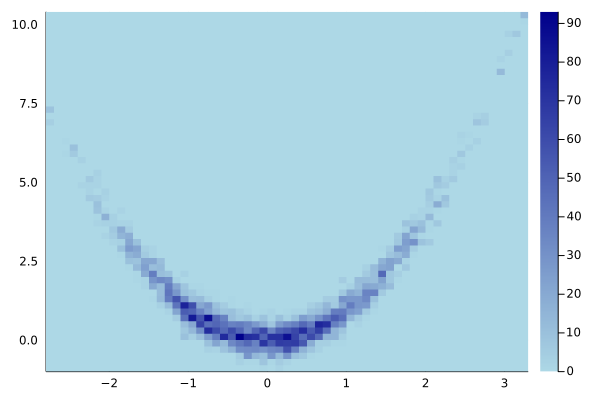

A (fast) implementation of parallel-tempered, ensemble MCMC.
Currently unregistered.

At the moment, the following are implemented:

    Sampling values of additional observables:
	- These should be packaged into a second output of 
	  the user's 'log_pdf' function, ie. 
	  'log_pdf(x)::(lp::Float64, obs::Vector{Float64})'

    Proposal Moves:
        - Ensemble "Stretch" Move (GW10)

    Parallel Tempering Schemes:
        - Fixed ladder of exponentially scaling temps, 
	  T = [1, dT^1, dT^2, ...]
          for user-input ladder size (`ntemps`) and dT (`dtemps`).
	- walkers 'w' are distributed to the ladder rungs
	  by modular arithmetic, ie. the rung 'r' of a walker 
	  index 'w' is 'r = (w-1) % ntemps'
        - Users can control of the overall likelihood of proposing
          temperature swaps at any step via
          `prob_propose_swap`; default = 0.1. 

    Automatic Multi-Threading using Threads.@threads

While these other options are not yet:

	- Reproducible randomness
	  (reproducible Julia RNGs are not thread-safe)
	- Adaptive temperature scaling 
	- Calculation of any diagnostics, such as the 
	  integrated autocorrelation -- 
	  use `MCMCChains.jl`for now. 

For example, to sample from Rosenbrock's banana function (2d), 

```julia
julia> using TemperedEnsembleMCMC
julia> log_pdf(x) = -1/20 * (100(x[2]-x[1]^2)^2 + (1-x[1])^2)

julia> nsteps = 50
julia> nwalkers = 300
# nsamples = nsteps * nwalkers
julia> init_samples = [ randn(2) for i=1:nwalkers ]

# split walkers into T=0 and T=1.41 "rungs"
julia> ntemps = 2
julia> dtemp = 1.41

# optionally, add burn-in steps which are not recorded
julia> nburnin_steps = 20

# also, note that our log_pdf function does not 
# produce any additional observables,
julia> save_observables = false

julia> out = TemperedEnsembleMCMC.run(
	log_pdf, init_samples;
	nsteps=nsteps, nwalkers=nwalkers, 
	nburnin_steps=20
	ntemps=2, dtemp=dtemp,
	save_observables=false)

julia> x, accepted, nswaps_accepted, nswaps_proposed, 
	log_probs, obs = out

# reshape the output to a matrix (ntemps, nwalkers) of (ndim),
# filter out only the T=1 samples,
# and then reshape to (nsamples,ndim)
julia> xx = reduce(vcat, x')
julia> xx1 = xx[:, [(w-1)%ntemps==0 for w in 1:nwalkers]]
julia> samples = reduce(vcat, xx1)

# plot!
julia> using Plots
julia> histogram2d(
	samples[:,1], samples[:,2],
	show_empty=true, bins=200, c=cgrad(:blues)
)
```


We can benchmark serial performance `using BenchmarkTools`

```julia
nthreads: 1

nsteps: 100
nwalkers: 2000

BenchmarkTools.Trial: 138 samples with 1 evaluation.
 Range (min … max):  27.029 ms … 119.866 ms  ┊ GC (min … max):  0.00% … 68.95%
 Time  (median):     35.333 ms               ┊ GC (median):    11.77%
 Time  (mean ± σ):   36.375 ms ±  11.187 ms  ┊ GC (mean ± σ):  16.31% ± 13.40%

   ▁ ▁   ▁█
  ▇█▇██▅▆██▆▂▂▁▁▂▁▁▂▁▁▁▂▁▁▁▁▁▁▁▁▁▁▂▁▁▁▁▁▁▁▁▁▁▁▁▁▁▁▁▁▁▁▁▁▁▁▁▁▁▂ ▂
  27 ms           Histogram: frequency by time          111 ms <

 Memory estimate: 25.29 MiB, allocs estimate: 230881.
```

and parallel:

```julia
nthreads: 4

nsteps: 100
nwalkers: 2000

BenchmarkTools.Trial: 260 samples with 1 evaluation.
 Range (min … max):  13.725 ms … 100.325 ms  ┊ GC (min … max):  0.00% … 82.18%
 Time  (median):     15.783 ms               ┊ GC (median):     0.00%
 Time  (mean ± σ):   19.283 ms ±   8.432 ms  ┊ GC (mean ± σ):  17.79% ± 17.80%

    █▇█▄▄
  ▃▆██████▅▄▂▂▂▂▃▁▂▁▁▁▂▁▁▁▁▂▁▂▂▃▄▃▅▅▄▆▄▂▃▃▃▃▄▄▆▂▄▁▁▁▁▁▁▁▁▁▂▁▁▂ ▃
  13.7 ms         Histogram: frequency by time         33.6 ms <

 Memory estimate: 25.72 MiB, allocs estimate: 233965.

```

References

Goodman & Weare (2010) https://msp.org/camcos/2010/5-1/camcos-v5-n1-p04-s.pdf

Foreman-Mackey et. al (2011) https://arxiv.org/abs/1202.3665
emcee: https://github.com/dfm/emcee

